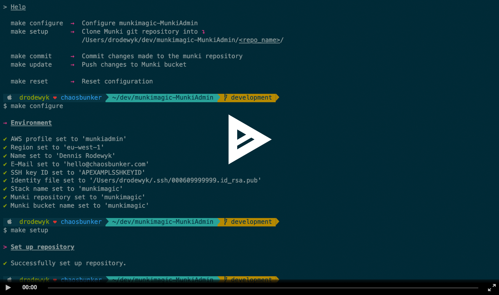

# munkimagic-MunkiAdmin

```
~$: make help

> Help

  make configure  →  Configure munkimagic-MunkiAdmin
  make setup      →  Clone Munki git repository into ↴
                     /Users/chaosbunker/munkimagic-MunkiAdmin/<repo-name>/
  
  make status     →  Show the working tree status of the munki repository
  make commit     →  Commit changes made to the munki repository
  make update     →  Push changes and update Munki bucket
  
  make reset      →  Reset configuration
```

Please refer to [the Wiki](https://github.com/chaosbunker/munkimagic-in-aws/wiki/How-to-for-Munki-admins) of [munkimagic-in-aws](https://github.com/chaosbunker/munkimagic-in-aws) for details.

[](https://asciinema.org/a/214827)
